# 五行力量分布引擎 — 流程图

```mermaid
flowchart TD
    START(["输入: 四柱 pillars[]<br/>年/月/日/时 — 天干/地支/藏干/十神"]) --> S1

    S1["<b>Step 1: 天干基分 + 月令得气</b><br/>━━━━━━━━━━━━━━━━━━<br/>每个天干: <br/>基分 = 3 × 气候系数(五行)<br/>根气分 = 正根3/库根2/藏干1 × 气候<br/>阴干根气 × 0.7<br/>得气: 月令生天干 → +⌊月令分/2⌋<br/><br/>▶ 计入 pillarRaw[i] 追踪各柱贡献"]
    S1 --> S2

    S2["<b>Step 2: 地支力量</b><br/>━━━━━━━━━━━━━━━━━━<br/>年(2) 月(5) 日(3) 时(4) × 气候系数<br/>月令地址 +5, 时支 +4, 日支 +3, 年支 +2<br/><br/>▶ 计入 pillarRaw[i]"]
    S2 --> S3

    S3["<b>Step 3: 同柱干支修正</b><br/>━━━━━━━━━━━━━━━━━━<br/>4 对同柱关系判断:<br/>盖头(干克支): 支-1<br/>截脚(支克干): 干-1<br/>天覆(干生支): 支+1<br/>地载(支生干): 干+1<br/>一气(干支同): 干+1 支+1<br/><br/>❌ 不受气候约束 (±1 原始值)"]
    S3 --> S4

    S4["<b>Step 4: 天干间生克</b><br/>━━━━━━━━━━━━━━━━━━<br/>全 6 对配对(不限相邻)<br/>距离衰减: 紧贴×1.0 / 隔柱×0.5 / 遥隔×0.3<br/>生: 受生方 +发出方系数×距离<br/>克: 被克方 -克方系数×距离<br/><br/>✅ 受发出方气候约束"]
    S4 --> S5

    S5["<b>Step 5: 地支间生克</b><br/>━━━━━━━━━━━━━━━━━━<br/>全 6 对配对(不限相邻)<br/>距离衰减: 紧贴×1.0 / 隔柱×0.5 / 遥隔×0.3<br/>生: 受生方 +发出方系数×距离<br/>克: 被克方 -克方系数×距离<br/><br/>✅ 受发出方气候约束"]
    S5 --> S6

    S6["<b>Step 6: 天干五合</b><br/>━━━━━━━━━━━━━━━━━━<br/>检查 6 对天干组合<br/>条件: 月令 = 化神五行<br/>成化: 原两行各-2, 化神+4<br/><br/>❌ 不受气候约束<br/>❌ 月令不支持则不化"]
    S6 --> S7

    S7["<b>Step 7: 地支六合</b><br/>━━━━━━━━━━━━━━━━━━<br/>子丑→土 寅亥→木 卯戌→火<br/>辰酉→金 巳申→水 午未→土<br/>化神 +3 × 化神气候<br/><br/>▶ 被合的支标记为填实"]
    S7 --> S8

    S8["<b>Step 8: 空亡</b><br/>━━━━━━━━━━━━━━━━━━<br/>以日柱查旬空两支<br/>空亡地支 -1<br/>已被六合/半合填实则不减"]
    S8 --> S9

    S9["<b>Step 9: 三合/半合</b><br/>━━━━━━━━━━━━━━━━━━<br/>申子辰→水 巳酉丑→金<br/>寅午戌→火 亥卯未→木<br/>全合: +6n × 化神气候<br/>前半合(含中神): +4n × 化神气候<br/>拱合(缺中神): +4n × 化神气候"]
    S9 --> S10

    S10["<b>Step 10: 三会</b><br/>━━━━━━━━━━━━━━━━━━<br/>寅卯辰→木 巳午未→火<br/>申酉戌→金 亥子丑→水<br/>全: +10n × 化神气候<br/>无半会"]
    S10 --> S11

    S11["<b>Step 11: 相刑</b><br/>━━━━━━━━━━━━━━━━━━<br/>寅巳申 / 丑戌未 / 子卯<br/>自刑: 辰午酉亥 ≥2<br/>三刑: -2 × 旺衰修正<br/>相刑: -1 × 旺衰修正<br/>旺(≥1.5)→×0.5 衰(≤0.7)→×2"]
    S11 --> S12

    S12["<b>Step 12: 六冲</b><br/>━━━━━━━━━━━━━━━━━━<br/>子午 丑未 寅申 卯酉 辰戌 巳亥<br/>冲: -5 × 旺衰修正<br/>四库冲: -3 × 旺衰修正<br/>旺(≥1.5)→×0.5 衰(≤0.7)→×2"]
    S12 --> S13

    S13["<b>Step 13: Floor at 0</b><br/>━━━━━━━━━━━━━━━━━━<br/>所有五行为负 → 归零<br/>(冲刑不产生负分)"]
    S13 --> S14

    S14["<b>Step 14: 位置远近调整</b><br/>━━━━━━━━━━━━━━━━━━<br/>年柱离日主隔柱 → ×0.5<br/>月/时/日柱紧贴 → ×1.0<br/>年柱天干+地支贡献各减半<br/>(仅调整原始基分,pillarRaw 追踪)"]
    S14 --> S15

    S15["<b>Step 15: 生克归日</b><br/>━━━━━━━━━━━━━━━━━━<br/>五行分 → 日主关系映射:<br/><br/>日主(含比劫) → dayScore<br/>印星(生我) → shengScore<br/>官杀(克我) → keScore<br/>食伤(我生) → ventScore<br/>财星(我克) → caiScore<br/><br/>自党 = dayScore + ⌊印星×气候/2⌋<br/>异党 = 官杀 + 食伤 + 财"]
    S15 --> S16

    S16{"<b>Step 16: 强弱判定</b><br/>━━━━━━━━━━━━━━━━━━<br/>自党 vs 异党"}
    S16 -->|"自党 > 异党"| STRONG
    S16 -->|"自党 < 异党"| WEAK
    S16 -->|"自党 = 异党"| NEUTRAL

    STRONG{"得令?<br/>日主气候 > 0.7"}
    STRONG -->|"是"| QIANG["<b>身强</b>"]
    STRONG -->|"否(失令)"| PIANWANG["<b>中和偏旺</b>"]
    WEAK --> RUO["<b>身弱</b>"]
    NEUTRAL --> ZHONGHE["<b>中和</b>"]

    style START fill:#1a1a2e,color:#e0e0e0
    style S1 fill:#2d5016,color:#fff
    style S2 fill:#2d5016,color:#fff
    style S3 fill:#4a3b1f,color:#fff
    style S4 fill:#1f3d5c,color:#fff
    style S5 fill:#1f3d5c,color:#fff
    style S6 fill:#5c1f1f,color:#fff
    style S7 fill:#3d1f5c,color:#fff
    style S8 fill:#2d2d2d,color:#fff
    style S9 fill:#3d1f5c,color:#fff
    style S10 fill:#3d1f5c,color:#fff
    style S11 fill:#5c3d1f,color:#fff
    style S12 fill:#5c3d1f,color:#fff
    style S13 fill:#2d2d2d,color:#fff
    style S14 fill:#1f4d5c,color:#fff
    style S15 fill:#4d1f4d,color:#fff
    style S16 fill:#4d1f4d,color:#fff
    style QIANG fill:#2d5016,color:#fff
    style PIANWANG fill:#4a6d1a,color:#fff
    style RUO fill:#5c1f1f,color:#fff
    style ZHONGHE fill:#4a4a2d,color:#fff
```



---

## 数据流

```
输入                           内部状态                      输出
─────                         ────────                     ──────
pillars[4]                    scores[5]                   scores[5]
 ├ gan → WX[gan]   ──Step1──→ scores[木/火/土/金/水]      details[]
 ├ zhi → ZWX[zhi]  ──Step2──→ + pillarRaw[4][5]          dayStrength
 ├ canggan[]                              ↓               dayScore
 └ shishen                        Step3-12 调整
  (十神,用于别处)                       ↓
                                  Step13 floor@0
                                        ↓
                                  Step14 年柱×0.5
                                        ↓
                                  Step15 归日映射
                                        ↓
                                  Step16 自党 vs 异党
```

## 五行生克环

```
              木
             /  \
       水生/    \木生
          /      \
         水───克──→火
          ↑        │
        金生       │火生
          │        ↓
          金←──克──土
           \      /
         土生\    /金生
              土
```

**生 (外圈)**: 木→火→土→金→水→木 — `(idx+1)%5`

**克 (内星)**: 木→土→水→火→金→木 — `(idx+2)%5`

对应代码 ORDER = `['木','火','土','金','水']`：

| 发出方 | (idx+1)%5 → 生谁 | (idx+2)%5 → 克谁 |
|--------|:--:|:--:|
| 木 | 火 | 土 |
| 火 | 土 | 金 |
| 土 | 金 | 水 |
| 金 | 水 | 木 |
| 水 | 木 | 火 |

## 气候系数作用范围

| Step | 是否受气候 | 说明 |
|------|:--:|------|
| 1 天干 | ✅ | 基分×cl + 根气×cl |
| 2 地支 | ✅ | 柱重×cl |
| 3 同柱 | ❌ | ±1 原始值 |
| 4 干间 | ✅ | 发出方系数×距离 |
| 5 地间 | ✅ | 发出方系数×距离 |
| 6 五合 | ❌ | +4/-2 原始值 |
| 7 六合 | ✅ | +3×化神cl |
| 8 空亡 | ❌ | -1 固定 |
| 9 半合/三合 | ✅ | +4/+6×化神cl |
| 10 三会 | ✅ | +10×化神cl |
| 11 相刑 | ✅ | 旺衰修正(系数阈值) |
| 12 六冲 | ✅ | 旺衰修正(系数阈值) |
| 13 Floor | — | — |
| 14 位置 | ❌ | 固定0.5/1.0 |
| 15 归日 | ✅ | 印扶身×印星气候 |
| 16 判定 | ✅ | 得令/失令判断 |
