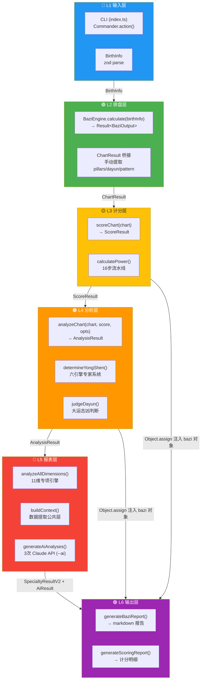
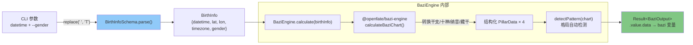
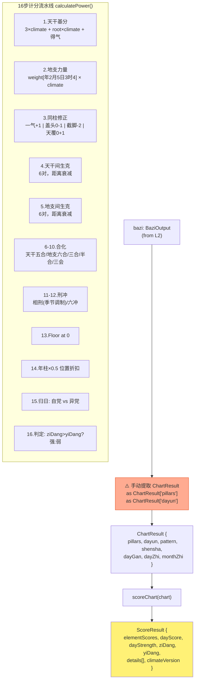
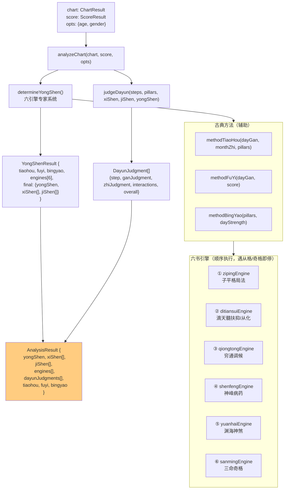
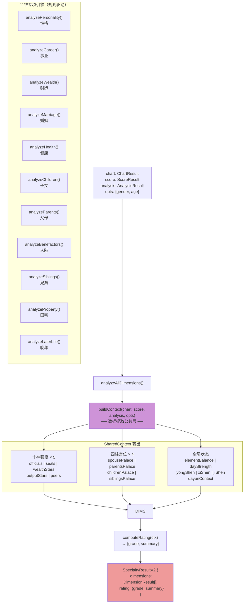
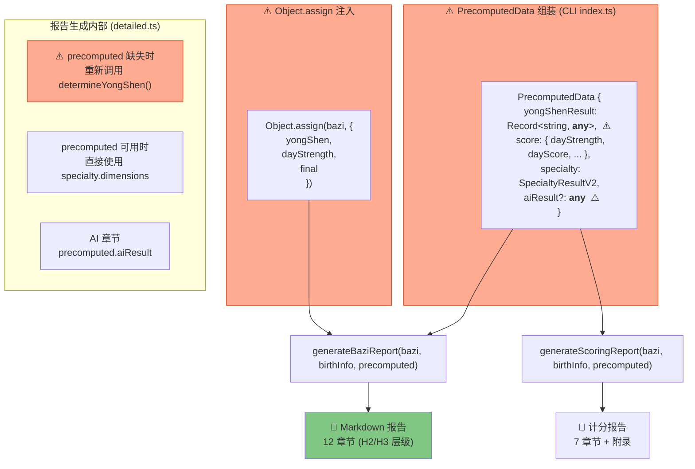
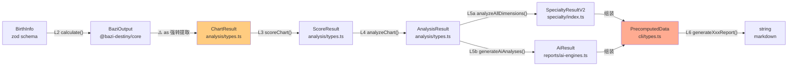

# 八字命理系统 — 数据流全景图

> 生成日期：2026-06-30 | 基于当前 `main` 分支代码

---

## 一、总览：六层单向数据流



**核心原则**：每层不调用上层函数。数据只能向下流动。

---

## 二、L1→L2：输入 → 排盘



**BaziOutput 结构**：
```
pillars: { 年柱, 月柱, 日柱, 时柱 }
  └─ { gan, zhi, nayin, shishen, canggan[] }
pattern: string
yongShen: '' (空，L4 填入)
shensha: {}
dayun: { startAgeYears, direction, steps[] }
  └─ step { startAge, endAge, gan, zhi, ganShishen, zhiShishen }
```

---

## 三、L2→L3：排盘 → 计分



### ⚠️ 问题点 E：L2→L3 桥接

CLI 中手动从 `BaziOutput` 提取字段构造 `ChartResult`，同时额外提取 `dayGan`/`dayZhi`/`monthZhi` 三个便捷字段。类型安全依赖 `as` 断言。

```typescript
// packages/cli/src/index.ts:116-124
const chart: ChartResult = {
  pillars: bazi.pillars as ChartResult['pillars'],
  dayun: bazi.dayun as ChartResult['dayun'],
  pattern: bazi.pattern as string || '',
  shensha: (bazi.shensha || {}) as ChartResult['shensha'],
  dayGan: (bazi.pillars as Record<string, {gan: string}>).日柱?.gan ?? '',
  dayZhi: (bazi.pillars as Record<string, {zhi: string}>).日柱?.zhi ?? '',
  monthZhi: (bazi.pillars as Record<string, {zhi: string}>).月柱?.zhi ?? '',
};
```

---

## 四、L3→L4：计分 → 分析



---

## 五、L4→L5a：分析 → 11维专项引擎



### SharedContext：关键计算

| 字段 | 计算逻辑 |
|------|---------|
| `peers.score` | = `max(0, dayElScore - dayOwnScore)` — 比劫分 = 同五行总分 - 日主自身分 |
| `strength` | >20% 强 / >5% 一般 / >0 弱 / ≤0 无 |
| `palace.isYongShen` | 宫位地支五行 ∈ 用神列表 |
| `clashes/combos` | 从 `score.details[]` 字符串匹配解析 |

---

## 六、L5b：AI 分析 （--ai 条件触发）

```mermaid
flowchart LR
    subgraph ai_input["AiInput 构造 (CLI index.ts)"]
        CD["chartData<br/>JSON.stringify(chart.pillars)"]
        SD["scoreData<br/>'自党X 异党Y 日主Z'"]
        AD["analysisData<br/>'用神A 喜B/C 忌D/E'"]
        SS2["specialtySummary<br/>dimensions 串联"]
        DYD["currentDayun/nextDayun<br/>dayunInteractions"]
        LND["liunianData<br/>'2026年 丙午'"]
    end
    
    ai_input --> GAA["generateAiAnalyses(AiInput)"]

    subgraph api["3 次 Anthropic API 调用（并行）"]
        YJ["generateYuanju(input)<br/>→ 原局分析"]
        DY["generateDayun(input)<br/>→ 大运解读"]
        LN["generateLiunian(input)<br/>→ 流年解读"]
    end
    
    GAA --> api
    api --> AIR["AiResult {<br/>  yuanju, dayun, liunian<br/>}"]
    
    style GAA fill:#E1BEE7
    style AIR fill:#CE93D8
```



**提示词模板**：`packages/reports/content/ai-prompts.json` → 注入参数 → `temperature: 0.3`

---

## 七、L5→L6：汇总 → 报告生成



---

## 八、类型流转全景



---

## 九、问题清单

| # | 严重度 | 问题 | 位置 | 影响 |
|---|--------|------|------|------|
| **A** | 中 | `PrecomputedData.yongShenResult: Record<string, any>` | `cli/types.ts:7` | 丢失 YongShenResult 类型信息，报告生成器使用时无类型提示 |
| **B** | 中 | `outputs.bazi as any` 多处强制类型转换 | `cli/index.ts` 多处 | L3/L4/L5 全部通过 `as any` 传参给报告生成器 |
| **C** | 低 | `Object.assign(bazi, {...})` 突变注入 | `cli/index.ts:137-141` | 修改 L2 输出对象，污染不变量；L4 结果混入 bazi 对象 |
| **D** | 中 | 报告生成器内部可重新计算 | `cli/detailed.ts:215-218` | `precomputed` 缺失时调用 `determineYongShen()`，打破单一数据源 |
| **E** | 低 | L2→L3 桥接手动拼字段 | `cli/index.ts:116-124` | `ChartResult` 需额外提取 `dayGan/dayZhi/monthZhi`，类型安全靠断言 |
| **F** | 低 | `aiResult?: any` 无类型 | `cli/types.ts:16` | AI 结果无结构约束 |
| **G** | 低 | `detailed.ts` 保留旧版 `baziDimension()` 函数 | `cli/detailed.ts:35` | 与 L5 `specialty` 引擎功能重复，两套实现并存 |

---

## 十、层间调用关系矩阵

| | L1 CLI | L2 Engine | L3 Score | L4 Analysis | L5a Specialty | L5b AI | L6 Report |
|---|---|---|---|---|---|---|---|
| **L1 CLI** | — | ✅ 调用 | ✅ 调用 | ✅ 调用 | ✅ 调用 | ✅ 调用 | ✅ 调用 |
| **L2 Engine** | ❌ | — | ❌ | ❌ | ❌ | ❌ | ❌ |
| **L3 Score** | ❌ | ❌ | — | ❌ | ❌ | ❌ | ❌ |
| **L4 Analysis** | ❌ | ❌ | ❌ | — | ❌ | ❌ | ❌ |
| **L5a Specialty** | ❌ | ❌ | ❌ | ❌ | — | ❌ | ❌ |
| **L5b AI** | ❌ | ❌ | ❌ | ❌ | ❌ | — | ❌ |
| **L6 Report** | ❌ | ❌ | ❌ | ❌ | ❌ | ❌ | — |

✅ = 该层被上层调用 / ❌ = 不会反向调用

**结论**：严格单向流已建立。当前不完善之处集中在：
1. CLI 编排层的类型安全（`as any` 泛滥）
2. `PrecomputedData` 的类型设计（`any` 字段）
3. L5→L6 的数据传递方式（`Object.assign` 突变 + 报告生成器 fallback 重新计算）

---

## 十一、改进方向（后续建议）

```
当前架构                         理想架构
────────                        ────────
BaziOutput                      BaziOutput
  │                                │
  ├─ as 提取 ChartResult           ├─ toChartResult() 类型安全转换
  ├─ as any 传参                    ├─ TypedPipeline<L1,L2,L3,L4,L5,L6>
  ├─ Object.assign 注入             ├─ PrecomputedData 不可变 + 强类型
  └─ precomputed fallback           └─ 报告生成器纯函数，无 fallback 计算
```

优先级：**C > A > D > B > E > F > G**
